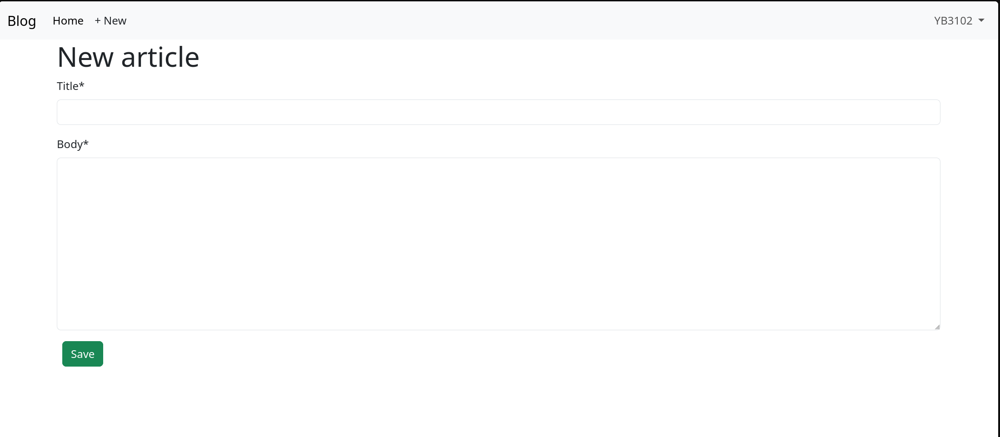
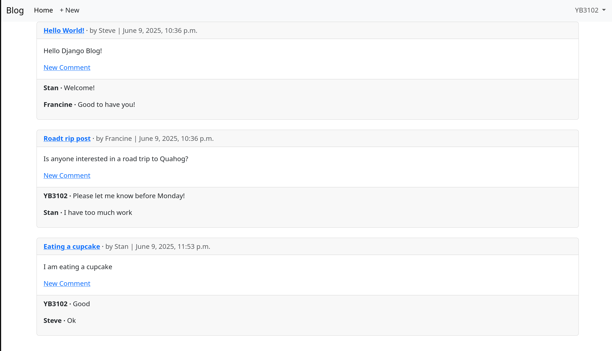
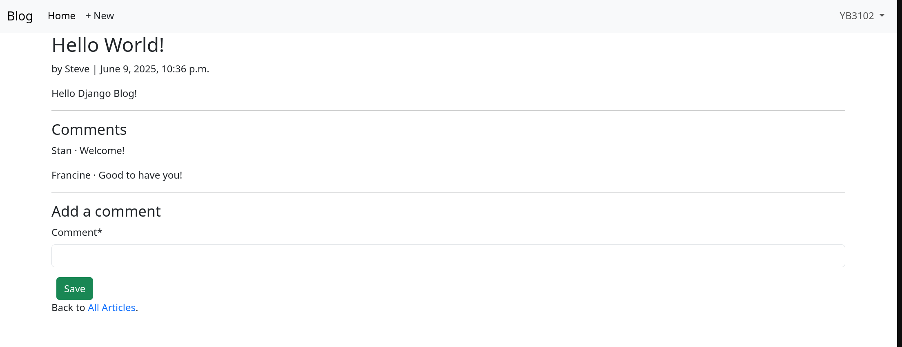

# Django Blog Website  

## 📌 Overview  
This project is a **Django-based web application** that explores building a basic **blogging forum**.  
It demonstrates how to structure, develop, and deploy a modern Django application with features such as **user authentication, articles/blog posts, static pages, and reusable templates**.  

The project is designed as a **learning and starter boilerplate** for building production-ready Django applications.

---

## 🚀 Features
- **User Accounts**
  - Registration, login, logout
  - Password reset via email
- **Articles App**
  - Create, read, update, delete (CRUD functionality)
  - List and detail views
- **Pages App**
  - Static and dynamic content pages
- **Template Inheritance**
  - Base templates for consistent design
  - Reusable UI components
- **Static & Media Files**
  - Static assets handled via Django’s staticfiles system
- **Deployment Ready**
  - Includes `Procfile` for Heroku deployment
  - Production-ready settings structure
- **Extensible Design**
  - Django allows to easily add and edit apps to extend functionality

---

## 🛠 Tech Stack
- **Backend:** Django 5.2.2 (Python 3.12)  
- **Frontend:** Django Templating Language + Javascript + Bootstrap
- **Database:** SQLite + Django ORM
- **Deployment:** Gunicorn + Heroku  

## ⚙️ Local Installation & Setup

### 1️⃣ Clone the Repository
```bash
git clone https://github.com/YB3102/TheDjangoBlog.git
cd TheDjangoBlog/
```

### 2️⃣ Create and Activate Virtual Environment
```bash
python3 -m venv .venv
source .venv/bin/activate 
```

### 3️⃣ Install Dependencies
```bash
pip install -r requirements.txt
```

### 4️⃣ Run Migrations
```bash
python3 manage.py migrate
```

### 5️⃣ Create Superuser
```bash
python3 manage.py createsuperuser
```

### 6️⃣ Run Development Server
```bash
python3 manage.py runserver
```

App will be available at the default localhost: http://127.0.0.1:8000/

---

## 📖 Learning Goals

This project covers:
- Django apps and project structure  
- Models, views, templates (MVT pattern)  
- Authentication system  
- Deployment best practices  

---

## 🔮 Future Improvements

- Add user profile pages  
- Add image/file uploads for articles  
- Integrate REST API using Django REST Framework  
- Implement pagination and search  

---

### New Article


### Articles


### Comment


---

## 🙌 Acknowledgements

This project is built with the help and guidance of the following book:  
**William S. Vincent – Django for Beginners (5th Edition)**  
[https://learndjango.com/courses/django-for-beginners/](https://learndjango.com/courses/django-for-beginners/)
